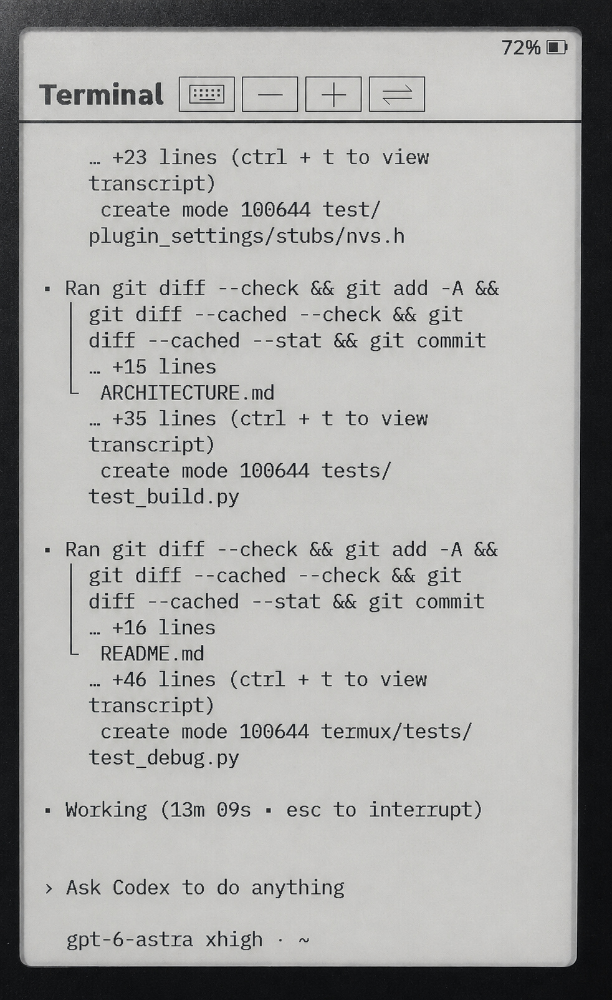

# CrossPoint Plugins

Independently built SD-loaded plugins for the experimental Xteink X4 Pro
CrossPoint fork. Normal plugin development and updates do not require a firmware
reflash.

The complete system is split across:

- [`crosspoint-reader`](https://github.com/mekhontsev/crosspoint-reader): minimal
  firmware host and generic authenticated BLE service;
- this repository: manager/updater, Terminal, background Debugger, SDK, and bundle;
- [`pagewire`](https://github.com/mekhontsev/pagewire): protocol plus the
  Android/Termux companion.

Use the single
[PageWire Terminal user guide](https://github.com/mekhontsev/pagewire/blob/main/docs/user-guide.md)
for installation, updates, controls, and recovery. See
[Plugin Architecture](ARCHITECTURE.md) and
[Plugin Development](PLUGIN_DEVELOPMENT.md) for implementation details.

> [!NOTE]
> This project is **AI vibe-coded** under maintainer direction, review, builds,
> and hardware testing.

The current **0.2.0** bundle uses plugin ABI **5** and contains:

- `manager.so`: lazy Plugins menu and Bluetooth child updater;
- `terminal.so`: PageWire v5 parser, continuous text cache, local layout,
  keyboard integration, persistent font size, and IBM Plex Mono fonts;
- `debugger.so`: lazy background status, logs, read-only SD access, and
  plugin-provided state/operations over the shared BLE connection.

The manager discovers child `.so` modules dynamically from their embedded
metadata. Neither manager nor firmware contains a hard-coded Terminal catalog.
Debugger has no menu row: requests from the companion load it alongside the
foreground plugin, using the same BLE connection.

## Terminal on X4 Pro

<a href="docs/images/terminal-x4pro.jpg"></a>

A photo of a tmux/Codex CLI session mirrored over Bluetooth to the SD-loaded
Terminal plugin. Open the photo for the full-size view.

## Install

Download the [v0.2.0 bundle](https://github.com/mekhontsev/crosspoint-plugins/releases/download/v0.2.0/crosspoint-plugins.zip)
and follow the [shared reader installation guide](https://github.com/mekhontsev/pagewire/blob/main/docs/user-guide.md#install-the-reader).
It requires matching ABI5 firmware.

Compatible child modules, including Debugger, can be updated from a local ZIP
over BLE. `manager.so` remains an SD/Wi-Fi update so the updater cannot replace
itself. The SD `bundle.json` is not a plugin catalog: discovery and validation
use embedded `.so` metadata. See the shared
[update procedure](https://github.com/mekhontsev/pagewire/blob/main/docs/user-guide.md#update-child-plugins-over-ble).

## Build

Place a compatible `crosspoint-reader` checkout beside this repository and run:

```sh
./bin/build
```

On Termux the wrapper uses the installed Ubuntu proot. Set
`CROSSPOINT_FIRMWARE_DIR` if the firmware checkout is elsewhere. The firmware
checkout supplies headers, compile flags, toolchain, and the host-symbol
allow-list; it does not build or link a firmware image.

Output: `build/crosspoint-plugins.zip`.

Host-side protocol checks (no reader required):

```sh
cmake -S tests -B build/tests
cmake --build build/tests
ctest --test-dir build/tests --output-on-failure
python3 -m unittest discover -s tests -p 'test_*.py' -v
```

Every module carries ABI, ELF length, SHA-256, and metadata. The loader validates
them before listing/loading a child. Activity modules are relocated to PSRAM
on selection, service modules on request. BLE starts only while an owning
plugin activity is open. These checks detect corruption and declared ABI
mismatches; native plugins remain trusted code, not sandboxed processes.

## License

Project code is MIT licensed. Generated IBM Plex Mono data derives from the SIL
Open Font License 1.1 font; see [FONT-LICENSE.txt](FONT-LICENSE.txt).
